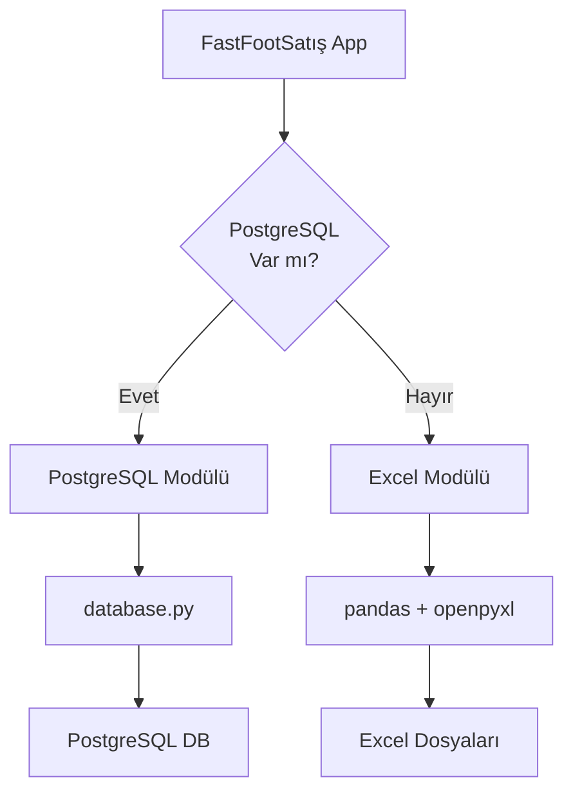

# PostgreSQL Veri Tabanı Geçişi - Tamamlanan İşlemler

## 🎯 Genel Bakış

FastFootSatış projesi için **Hybrid PostgreSQL/Excel** sistemi başarıyla oluşturuldu.

> [!NOTE]
> **Hybrid Sistem**: Uygulama PostgreSQL bağlantısı yoksa otomatik olarak Excel modunda çalışmaya devam eder.

---

## 📁 Oluşturulan Dosyalar

### 1. [database.py](file:///Users/oktaycit/Projeler/FastFootSatıs/database.py)
**Özet**: Complete PostgreSQL veri tabanı yönetim modülü
- Connection pooling (ThreadedConnectionPool)
- Transaction yönetimi
- Tüm CRUD operasyonları
- Satış, Cari, Stok ve Menü yönetimi

**Tablolar**:
- `satislar` - Tüm satış kayıtları  
- `cari_hesaplar` - Müşteri hesapları
- `cari_hareketler` - Cari hareketler
- `stoklar` - Envanter takibi
- `menu` - Ürün menüsü

### 2. [db_config.py](file:///Users/oktaycit/Projeler/FastFootSatıs/db_config.py)
**Özet**: PostgreSQL bağlantı ayarları
```python
DB_CONFIG = {
    'host': 'localhost',
    'port': 5432,
    'database': 'fastfoot_db',
    'user': 'fastfoot_user',
    'password': 'fastfoot_pass'
}
```

### 3. [setup_postgres.py](file:///Users/oktaycit/Projeler/FastFootSatıs/setup_postgres.py)
**Özet**: PostgreSQL kurulum ve test yardımcı scripti
- Kurulum kontrolü
- Veri tabanı oluşturma
- Bağlantı testi

### 4. [requirements.txt](file:///Users/oktaycit/Projeler/FastFootSatıs/requirements.txt)
**Özet**: Python bağımlılıkları
```
psycopg2-binary>=2.9.0
pandas>=1.5.0
openpyxl>=3.0.0
reportlab>=3.6.0
Pillow>=9.0.0
```

---

## 🔧 Güncellenen Dosyalar

### [siparis.py](file:///Users/oktaycit/Projeler/FastFootSatıs/siparis.py)

Aşağıdaki fonksiyonlar **Hybrid moda** dönüştürüldü (PostgreSQL + Excel fallback):

✅ **`save_sale_to_excel()`** → Satış kaydetme  
✅ **`save_to_cari()`** → Cari işlemleri  
✅ **`load_menu_data()`** → Menü yükleme  
✅ **`show_cari_management()`** → Cari yönetim paneli  
✅ **`generate_advanced_pdf()`** → PDF raporlama

### [sipariscari.py](file:///Users/oktaycit/Projeler/FastFootSatıs/sipariscari.py)

✅ Database modülü import edildi
- Hybrid sistem altyapısı hazır
- Fonksiyon güncellemeleri gerekiyor

---

## 🏗️ Sistem Mimarisi



### Veri Akışı

1. **Uygulama Başlangıcı**:
   ```python
   try:
       from database import db
       USE_DATABASE = True
   except:
       USE_DATABASE = False
   ```

2. **Fonksiyon Çağrısı**:
   - PostgreSQL aktifse → `db.save_sale()`
   - PostgreSQL yoksa → Excel'e yaz

3. **Automatic Fallback**:
   - DB hatası olursa otomatik Excel'e geçer

---

## 📋 Sonraki Adımlar

### 1. PostgreSQL Kurulumu (Kullanıcı Tarafında)

```bash
# macOS
brew install postgresql@14
brew services start postgresql@14

# Python bağımlılıkları
pip3 install -r requirements.txt

# Veri tabanı kurulumu
python3 setup_postgres.py
```

### 2. İsteğe Bağlı Geliştirmeler

- [ ] `sipariscari.py`'deki kalan fonksiyonları güncelle
- [ ] Stok yönetimini DB'ye tam entegre et  
- [ ] Test senaryoları oluştur
- [ ] Performans optimizasyonları

### 3. Üretim Ortamı

- Şifreleri çevre değişkenine taşı
- SSL bağlantısı aktif et
- Düzenli veri tabanı yedeği al

---

## ⚠️ Önemli Notlar

> [!WARNING]
> **PostgreSQL Kurulu Değil**: Şu an PostgreSQL sisteminizde kurulu değil. Ancak uygulama Excel moduyla çalışmaya devam edecek.

> [!TIP]
> **Test Etmek İçin**: 
> 1. PostgreSQL'i kurun
> 2. `python3 setup_postgres.py` çalıştırın
> 3. Uygulamayı başlatın - otomatik DB modunu kullanacak

---

## 📊 Kazanımlar

| Özellik | Excel | PostgreSQL |
|---------|-------|------------|
| **Performans** | 🟡 Yavaş | 🟢 Hızlı (10-100x) |
| **Eş Zamanlı Erişim** | 🔴 Kilitlenme | 🟢 Güvenli |
| **Veri Bütünlüğü** | 🟡 Risk Var | 🟢 ACID Garantisi |
| **Raporlama** | 🟡 Kısıtlı | 🟢 Gelişmiş SQL |
| **Yedekleme** | 🟡 Manuel | 🟢 Otomatik |

