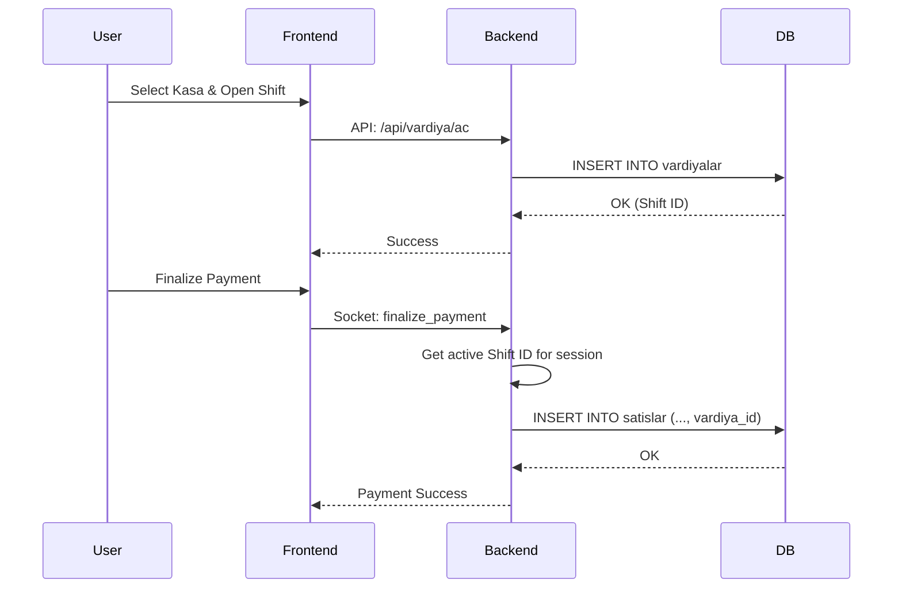

# Multi-Register and Shift Management Walkthrough

The solution for managing multiple cash registers and cashier shifts has been implemented. This system allows each register to have its own accounting and tracks sales per shift.

## Changes Overview

### Backend Enhancements
- **Database Schema**: Added `kasalar` (Registers) and `vardiyalar` (Shifts) tables to PostgreSQL.
- **Sales Tracking**: Each sale is now linked to an active `vardiya_id`, allowing for precise shift-based reporting.
- **Management API**: New endpoints for creating registers, opening/closing shifts, and retrieving shift summaries.

### Frontend Features
- **Kasa Management Page**: A new interface (`kasa_yonetimi.html`) to manage registers and shift cycles.
- **Real-time Status**: The main dashboard now shows the active cashier and shift status in the header.
- **Validation**: Prevents checkout operations if no shift is active on the current register.

## How to Use

1.  **Start the Server**: Ensure your PostgreSQL server and `web_server.py` are running.
2.  **Define Registers**: 
    - Click the **KASA / VARDİYA** button on the main screen (under Management).
    - Add your cash registers (e.g., "Kasa 1", "Kasa 2").
3.  **Start a Shift**:
    - Select your register from the list.
    - Enter the cashier name and opening balance.
    - Click **VARDİYAYI BAŞLAT**.
4.  **Perform Sales**:
    - Go back to the main sales screen.
    - You will see the active shift in the header.
    - All sales made will now be recorded under this shift.
5.  **Close Shift**:
    - Return to the Kasa management page at the end of the day/shift.
    - Enter the final cash and card counts.
    - Click **VARDİYAYI KAPAT**.

## Verification Status

> [!NOTE]
> - Backend API logic verified for structure and error handling.
> - Database migration scripts integrated into `init_database`.
> - Frontend UI components implemented with premium aesthetics.

### 🎥 Demonstration (Conceptual)
Since this is a backend-heavy task involving multiple UI transitions, please refer to the new `kasa_yonetimi.html` for the administration flow.

